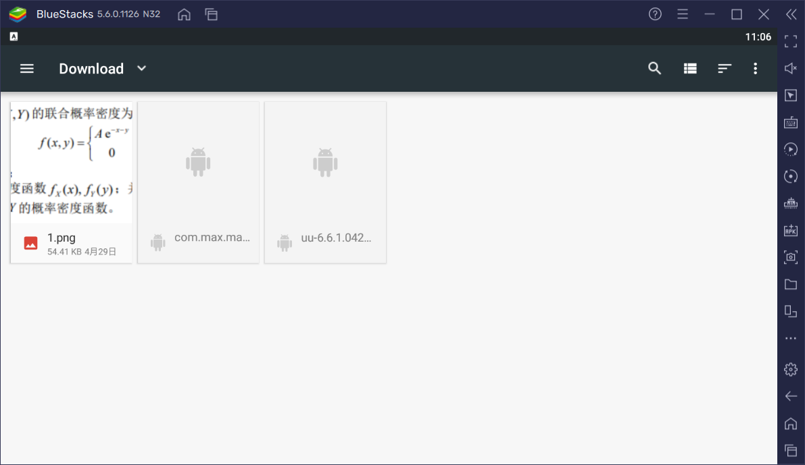

# XueXiaoYi
一个电脑快速使用学小易的搜题工具，使用airtest+python。他会实时监听您的剪贴板，并将剪贴板中的文字或图片自动送给学小易进行搜索~


**前排提示：需要电脑装有安卓模拟器，模拟器能够打开adb！！！**


**求星~**


## 功能

1. 监听您的剪贴板，并将剪贴板（可以按win+v键查看剪贴板内容）中的文字或图片自动送给学小易进行搜索~

   

## 使用

1. 打开你的安卓模拟器及其adb调试功能（具体打开方法参见自己模拟器的帮助）

   P.S.我使用是蓝叠国际版，也推荐大家使用这个版本

2. 打开学小易，手动登录并进入文字搜索页面

   示例：

   

3. 运行.py文件

4. 按win+v查看你的剪贴板，若出现 *剪切板初始化>_<!* 则启动成功

5. 之后每次您的剪贴板有变化时，程序都会自动执行并为你查题

**P.S.剪贴板如果接收到图片，他将会把图片发送到模拟器 /sdcard/Download/1.png 路径下，请确保您的学小易在点开选择图片的时候在此目录！！！**

示例：




## 环境

python3及以上

airtest库

```python
#airtest安装
pip install airtest
pip install pocoui
```

pyperclip库

```python
# pyperclip安装
pip install pyperclip
```
